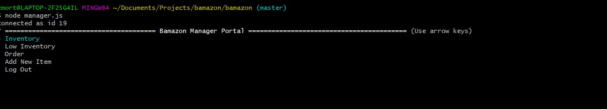
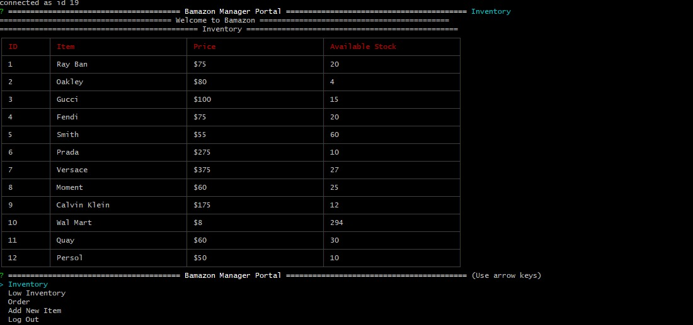
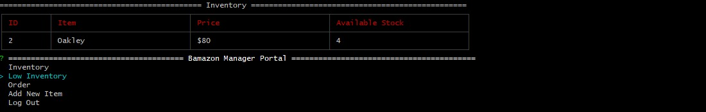
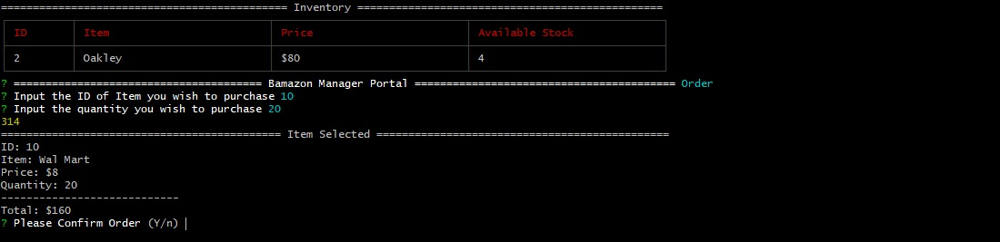
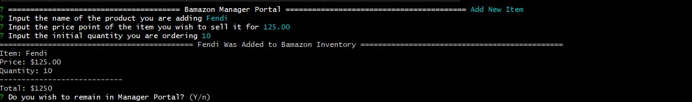
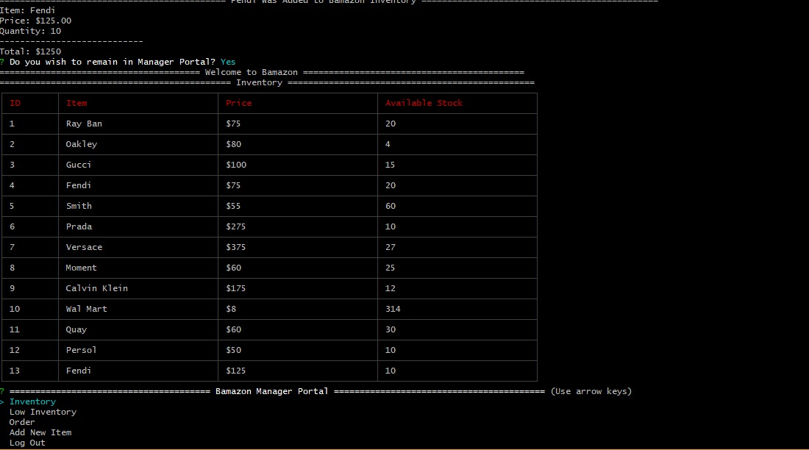

#Bamazon - Web Store
Bamazon is an online store that sells discounts on well-known sunglasses brands.
1. Use the keyboard to type for inputs 
2. Type "y"/"n" for yes or no prompts
3. Arrow keys to navigate menus.
All selections are made with the "enter" button.

## Bamazon - Customer

### 1. Begin

To run the customer portal, in your terminal, type: "node customer.js" then hit the enter button. After you hit enter the inventory will display with the item description, cost, and quantity available.

### 2. Follow the Prompts.

A. you will be asked to type the ID of the item you wish to purchase. Push enter after you have typed the ID.

B. Then you will be asked how many you wish to purchase. Push enter after you have typed the quantity you wish to purchase.

C. You will be asked to confirm your order, be sure to check the item you have selected is correct as well as the quantity, and your total billings.

D. After the order is confirmed you will be asked if you wish to continue shopping(Y/n).
If (y), then you will be sent back to intial screen with the updated inventory amount.

Else If(n), then you will log off.

## Bamazon - Manager

### 1. Begin

To run the manager portal, in your terminal, type: "node manager.js" then hit the enter button. After you hit enter the a menu will appear.

### 2. Menu Selection.
#### Inventory
Displays the entire inventory of your store and works the same as customer.js

#### Low Inventory
Displays the inventory of an ID that has a quantity of 5 or less. Works the same way as inventory but filters results for easy ordering.

#### Order
Allows you as the manager to order new merchandise to fill low or empty inventory

1. Input the ID of the item you wish to order.
2. Input the quantity you wish to fill.
3. You will be given a total for you to review then you can confirm the order.
#### Add New Item
Allows for the addition of new items you wish to carry in Bamazon.
1. Input the name of the item you are adding.
2. Input the amount you are selling the item for.
3. Input the initial quantity you want to order.

#####Notes:
A. You must use the order menu item for all future orders.
B. Be sure that you want to add the item because there is not a verification screen after entering the quantity.

After you have added the item you can choose to remain in the inventory(y/n)

#### Log Out
Logs out of the Manager portal.

## Bamazon - Supervisor
### 1. Menu
Incomplete section because it needs to be inner-joined with another departments table.