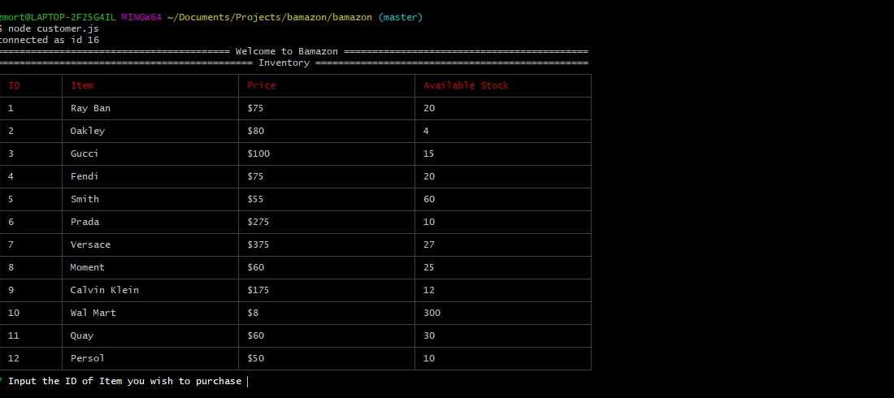
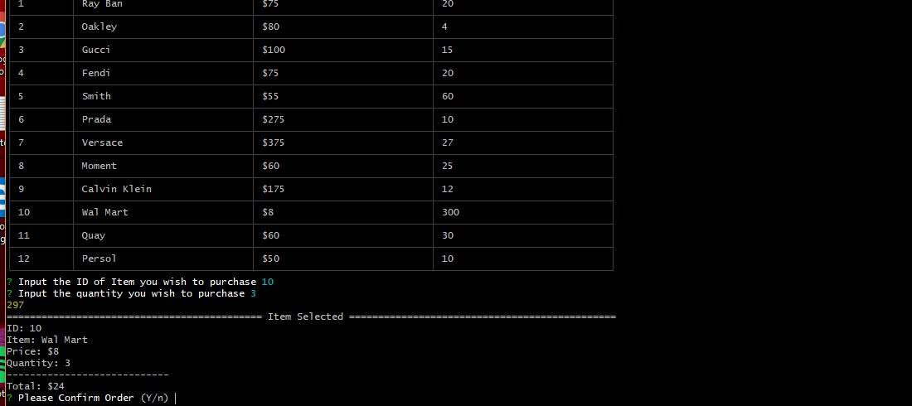
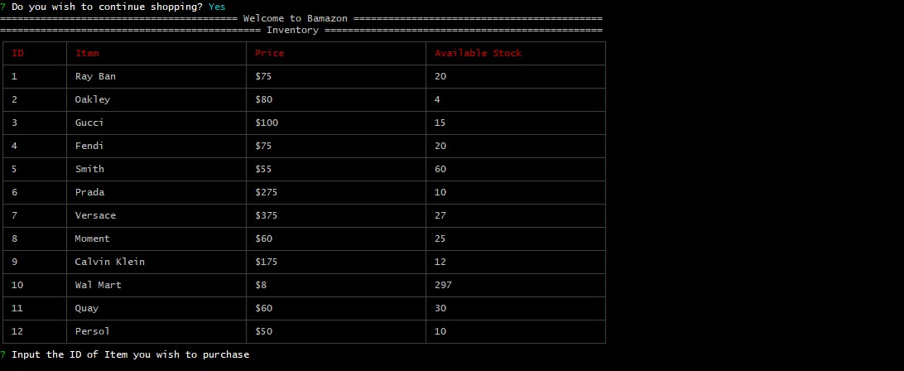

# Bamazon - Customer
### 1. Begin

To run the customer portal, in your terminal, type: "node customer.js" then hit the enter button. After you hit enter the inventory will display with the item description, cost, and quantity available.

### 2. Follow the Prompts.

A. you will be asked to type the ID of the item you wish to purchase. Push enter after you have typed the ID.

B. Then you will be asked how many you wish to purchase. Push enter after you have typed the quantity you wish to purchase.

C. You will be asked to confirm your order, be sure to check the item you have selected is correct as well as the quantity, and your total billings.

D. After the order is confirmed you will be asked if you wish to continue shopping(Y/n).
If (y), then you will be sent back to intial screen with the updated inventory amount.

Else If(n), then you will log off.

# Bamazon - Manager

# Bamazon - Supervisor